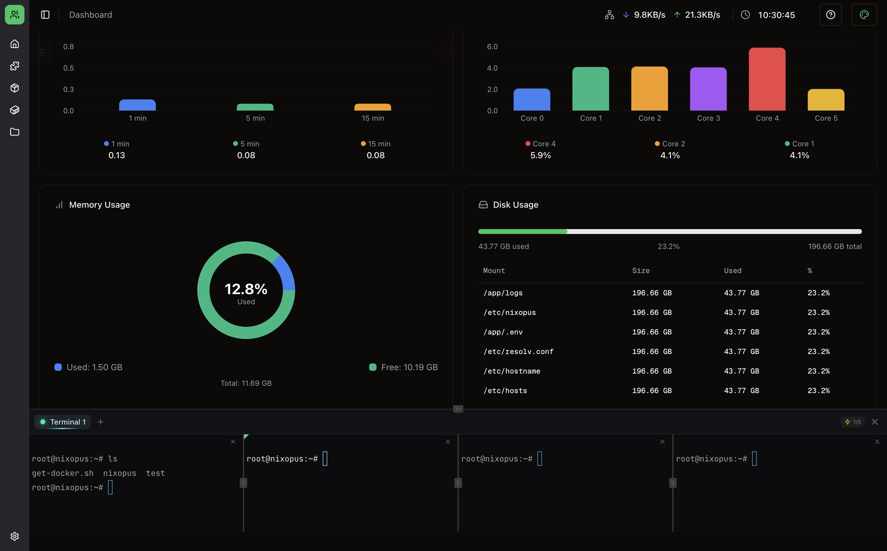

<div align="center">

<a id="readme-top"></a>

<a href="https://nixopus.com"></a>

<h5 align="center">
  Open Source Vibe Deploy for full-stack apps under 60 seconds.
</h5>

<p align="center">
  <a href="https://nixopus.com"><b>Website</b></a> •
  <a href="https://docs.nixopus.ai"><b>Documentation</b></a> •
  <a href="https://nixopus.com/blog"><b>Blog</b></a> •
  <a href="https://discord.gg/skdcq39Wpv"><b>Join Discord</b></a> •
  <a href="https://github.com/raghavyuva/nixopus/discussions/262"><b>Roadmap</b></a>
</p>

<p align="center">
  <a href="https://github.com/raghavyuva/nixopus/stargazers"></a>
  <a href="https://github.com/raghavyuva/nixopus/network/members"></a>
  <a href="https://github.com/raghavyuva/nixopus/issues"></a>
  <a href="https://github.com/raghavyuva/nixopus/blob/master/LICENSE.md"></a>
  <br>
  <a href="https://trendshift.io/repositories/15336" target="_blank"></a>
</p>

</div>

---

<details>
<summary><h2>Table of Contents</h2></summary>

- [Getting Started](#getting-started)
  - [Quick Start](#quick-start)
- [Features](#features)
  - [⚡ Zero ops](#zero-ops)
  - [⏱️ 60-second deploys](#60-second-deploys)
  - [🧩 Framework agnostic](#framework-agnostic)
  - [🔒 Auto HTTPS](#auto-https)
  - [🌐 Custom domains](#custom-domains)
  - [↩️ Instant rollbacks](#instant-rollbacks)
  - [💻 Built-in terminal](#built-in-terminal)
  - [🤖 AI-powered](#ai-powered)
  - [🔓 Open source \& self-hostable](#open-source--self-hostable)
- [Demo](#demo)
  - [What you’ll see](#what-youll-see)
  - [Screenshots (placeholders)](#screenshots-placeholders)
  - [Video (placeholder)](#video-placeholder)
  - [Live Preview (optional)](#live-preview-optional)
- [Self-hosting](#self-hosting)
  - [Quick Install](#quick-install)
  - [Custom Installation](#custom-installation)
  - [Installation Options](#installation-options)
- [Contributing](#contributing)
- [About the Name](#about-the-name)
- [License](#license)

</details>

---

<a id="getting-started"></a>
## Getting Started

> **Important Note**: Nixopus is currently in **alpha/pre-release** stage and is not yet ready for production use. While you're welcome to try it out, we recommend waiting for the beta or stable release before using it in production environments.

**Vibe Deploy for full-stack apps. From code to live in under 60 seconds.**

Nixopus is the deployment platform that eliminates ops. Connect your repo, go live, and focus on building.

On **[docs.nixopus.ai](https://docs.nixopus.ai/)**:

- **[Quickstart](https://docs.nixopus.ai/getting-started/quickstart)** — Go from code to live in under 60 seconds.
- **[Self-hosting](https://docs.nixopus.ai/getting-started/self-hosting)** — Run Nixopus on your own infrastructure.
- **[API reference](https://docs.nixopus.ai/api-reference/introduction)** — Interact with Nixopus programmatically.
- **[Editor extension](https://docs.nixopus.ai/extension/overview)** — Vibe deploy from VS Code or Cursor.

### Quick Start

To self-host from this repo on a VPS:

1. **Install Nixopus**:
   ```bash
   curl -sSL https://install.nixopus.com | bash
   ```

2. **Open the dashboard** at `http://your-server-ip` or your configured domain.

3. **Deploy a project** by connecting a GitHub repository.

See **[Self-hosting: Installation](https://docs.nixopus.ai/self-hosting/installation)** for full setup options and configuration.

> [!IMPORTANT]
> Star & Watch, you'll receive all release notifications from GitHub without any delay.


---


<a id="features"></a>
## ✨ Features

Nixopus is a deployment platform that eliminates ops entirely. You push code, you go live—no Dockerfiles to wrangle, no CI pipelines to wire, no servers to babysit. Built for people who would rather ship than manage infrastructure.

<a id="zero-ops"></a>



### [⚡ Zero ops](https://docs.nixopus.ai/getting-started/introduction#why-nixopus)

**Push your code; Nixopus handles builds, deployments, SSL, and routing.**

You skip standing up CI and sizing boxes just to get a live URL.

<div align="right">

[↑ Back to top](#readme-top)

</div>

<a id="60-second-deploys"></a>


### [⏱️ 60-second deploys](https://docs.nixopus.ai/getting-started/introduction#why-nixopus)

**Pick a build pack, deploy, and go live—about a minute from connect to production.**

Repeat the same short path on every change.

<div align="right">

[↑ Back to top](#readme-top)

</div>

<a id="framework-agnostic"></a>


### [🧩 Framework agnostic](https://docs.nixopus.ai/getting-started/introduction#why-nixopus)

**Next.js, Remix, Astro, FastAPI, Go, Rails—or anything else that runs in a container.**

If it fits a container image, it can ship on Nixopus.

<div align="right">

[↑ Back to top](#readme-top)

</div>

<a id="auto-https"></a>


### [🔒 Auto HTTPS](https://docs.nixopus.ai/getting-started/introduction#why-nixopus)

**Every deployment gets TLS out of the box via Caddy—no cert files, no manual HTTPS toggles.**

HTTPS is the default.

<div align="right">

[↑ Back to top](#readme-top)

</div>

<a id="custom-domains"></a>


### [🌐 Custom domains](https://docs.nixopus.ai/getting-started/introduction#why-nixopus)

**Point your domain at Nixopus; routing and certificates follow.**

Traffic hits your app on your hostname with HTTPS.

<div align="right">

[↑ Back to top](#readme-top)

</div>

<a id="instant-rollbacks"></a>


### [↩️ Instant rollbacks](https://docs.nixopus.ai/getting-started/introduction#why-nixopus)

**Roll back to any previous deployment from the Deployments tab.**

When a release misbehaves, restore known-good state without redeploy guesswork.

<div align="right">

[↑ Back to top](#readme-top)

</div>

<a id="built-in-terminal"></a>


### [💻 Built-in terminal](https://docs.nixopus.ai/getting-started/introduction#why-nixopus)

**SSH into your server or containers from the dashboard.**

Debug and operate without juggling a separate terminal or jump host.

<div align="right">

[↑ Back to top](#readme-top)

</div>

<a id="ai-powered"></a>


### [🤖 AI-powered](https://docs.nixopus.ai/extension/overview)

**The [editor extension](https://docs.nixopus.ai/extension/overview) can generate Dockerfiles, analyze your codebase, and drive deploys from VS Code or Cursor.**

Stay in the editor while Nixopus ships the app.

<div align="right">

[↑ Back to top](#readme-top)

</div>

<a id="open-source--self-hostable"></a>


### [🔓 Open source & self-hostable](https://docs.nixopus.ai/getting-started/self-hosting)

**Run Nixopus on your own infrastructure or use Nixopus Cloud.**

Open source and self-hostable—no lock-in, no surprises.

<div align="right">

[↑ Back to top](#readme-top)

</div>

---

<a id="demo"></a>
## Demo

See Nixopus in action, from deployments to day-to-day operations on your VPS.

### What you’ll see

- **Deploy from GitHub**: connect a repo and ship updates with a streamlined flow
- **Operate from the dashboard**: manage apps, domains, env vars, and deployments in one place
- **Built-in tools**: use the web terminal + file manager without leaving your browser

### Screenshots (placeholders)

> Replace the image paths below when you’re ready (screenshots / gifs / videos will be added later).

<div align="center">

| Dashboard | Hosting Projects |
| --- | --- |
|  |  |
| *Overview of deployments, health, and activity* | *Connect a repo, deploy, and manage releases* |

| Terminal | File Manager |
| --- | --- |
|  |  |
| *Run commands securely from the browser* | *Upload, edit, and organize server files visually* |

</div>

### Video (placeholder)

- **Demo video**: (add YouTube link / MP4 later)

### Live Preview (optional)

- (add hosted demo URL later)

---

<a id="self-hosting"></a>
## Self-hosting

### Quick Install

Install Nixopus on your VPS with a single command:

```bash
curl -sSL https://install.nixopus.com | bash
```

### Custom Installation

**For custom IP setups:**

```bash
curl -sSL https://install.nixopus.com | bash -s -- --host-ip 10.0.0.154
```

**To install only the CLI tool:**

```bash
curl -sSL https://install.nixopus.com | bash -s -- --skip-nixopus-install
```

### Installation Options

You can customize your installation with the following optional parameters:

| Parameter | Short | Description | Example |
|-----------|-------|-------------|---------|
| `--api-domain` | `-ad` | Domain for Nixopus API | `nixopusapi.example.tld` |
| `--view-domain` | `-vd` | Domain for Nixopus dashboard | `nixopus.example.tld` |
| `--host-ip` | `-ip` | IP address of the server | `10.0.0.154` |
| `--verbose` | `-v` | Show detailed installation logs | - |
| `--timeout` | `-t` | Timeout for each step (default: 300s) | `600` |
| `--force` | `-f` | Replace existing files | - |
| `--dry-run` | `-d` | Preview changes without applying | - |
| `--config-file` | `-c` | Path to custom config file | `/path/to/config.yaml` |

**Example with custom domains:**

```bash
sudo nixopus install \
  --api-domain nixopusapi.example.tld \
  --view-domain nixopus.example.tld \
  --verbose \
  --timeout 600
```

> [!NOTE]
> Running `nixopus install` requires root privileges (sudo) to install system dependencies like Docker. If you encounter permission errors, make sure to run the command with `sudo`.

For more detailed installation instructions, visit **[Self-hosting: Installation](https://docs.nixopus.ai/self-hosting/installation)**.

---

<a id="contributing"></a>
## Contributing

Contributions are what make the open source community such an amazing place to learn, inspire, and create. Any contributions you make are **greatly appreciated**, feel free to check out our [Github Issues](https://github.com/raghavyuva/nixopus/issues)

Thank you to all the contributors who help make Nixopus better!

<a href="https://github.com/raghavyuva/nixopus/graphs/contributors">
  
</a>

---

<a id="about-the-name"></a>
## About the Name

Nixopus is derived from the combination of "octopus" (representing flexibility and multi-tasking) and the Linux penguin mascot (Tux). While the name might suggest a connection to [NixOS](https://nixos.org/), Nixopus is an independent project with no direct relation to NixOS or its ecosystem.

---

<a id="license"></a>
## License

Distributed under the FSL-1.1-ALv2 License. Visit [LICENSE.md](./LICENSE.md) for more information.

---


<div align="center">

**Made with ❤️ by the Nixopus community**

[Back to top](#readme-top)

</div>