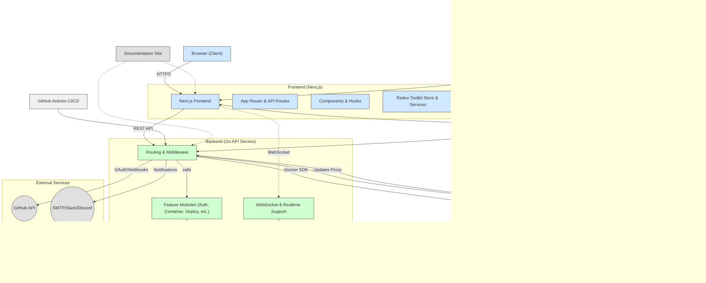

# Nixopus

<p align="center">
  
</p>

<div align="center">

[](https://github.com/raghavyuva/nixopus/actions/workflows/security.yml)
[](https://github.com/raghavyuva/nixopus/actions/workflows/build_container.yml)
[](https://github.com/raghavyuva/nixopus/actions/workflows/release.yml)

[Website](https://nixopus.com) | [Documentation](https://docs.nixopus.com) | [Join Community](https://discord.gg/skdcq39Wpv)

</div>

## Your All-in-One VPS Management Solution

Nixopus is a powerful platform designed to simplify VPS management. Whether you're a DevOps engineer, system administrator, or developer, Nixopus streamlines your workflow with comprehensive tools for deployment, monitoring, and maintenance.

> ⚠️ **Important Note**: Nixopus is currently in alpha/pre-release stage and is not yet ready for production use. While you're welcome to try it out, we recommend waiting for the beta or stable release before using it in production environments. The platform is still undergoing testing and development.

## Why Nixopus?

In today's software landscape, feature bloat often leads to cluttered and confusing interfaces. We recognize that developers are users too, and they deserve a superior experience. Nixopus takes a different approach - instead of stacking features, we focus on creating elegant software that appears simple on the surface while hiding powerful capabilities beneath.

While many excellent software solutions exist, each with their own strengths, we choose not to directly compare Nixopus with other solutions. Instead, we believe that true value comes from user engagement and community feedback. Our philosophy is simple: we invite you to explore Nixopus, share your experiences, and help shape its future. We understand that no software is perfect - there's always room for improvement, and it's the user's perspective that truly matters in making something great.

## Demo
[](https://www.youtube.com/watch?v=DrDGWNq4JM4)


## Documentation

For complete documentation, visit our [Documentation Portal](https://docs.nixopus.com).

### Installation

This section will help you set up Nixopus on your VPS quickly.

To install Nixopus on your VPS, ensure you have sudo access and run the following command:

```
sudo bash -c "$(curl -sSL https://raw.githubusercontent.com/raghavyuva/nixopus/refs/heads/master/scripts/install.sh)"
```

#### Optional Parameters

You can customize your installation by providing the following optional parameters:

- `--api-domain`: Specify the domain where the Nixopus API will be accessible (e.g., `nixopusapi.example.tld`)
- `--app-domain`: Specify the domain where the Nixopus app will be accessible (e.g., `nixopus.example.tld`)
- `--email` or `-e`: Set the email for the admin account
- `--password` or `-p`: Set the password for the admin account

Example with optional parameters:
```
sudo bash -c "$(curl -sSL https://raw.githubusercontent.com/raghavyuva/nixopus/refs/heads/master/scripts/install.sh)" -- \
  --api-domain nixopusapi.example.tld \
  --app-domain nixopus.example.tld \
  --email admin@example.tld \
  --password Adminpassword@123 \
  --env production
```

#### Accessing Nixopus

After successful installation, you can access the Nixopus dashboard by visiting the URL you specified in the `--app-domain` parameter (e.g., `https://nixopus.example.tld`). Use the email and password you provided during installation to log in.

> **Note**: The installation script has not been tested in all distributions and different operating systems. If you encounter any issues during installation, please create an issue on our [GitHub repository](https://github.com/raghavyuva/nixopus/issues) with details about your environment and the error message you received.

## Contributing to Nixopus

Thank you for your interest in contributing to Nixopus! This guide will help you get started with the development setup and explain the contribution process.

### Code of Conduct

Before contributing, please review and agree to our [Code of Conduct](/code-of-conduct/index.md). We're committed to maintaining a welcoming and inclusive community.

### Development Setup

1. Clone the repository:
```bash
git clone https://github.com/raghavyuva/nixopus.git
cd nixopus
```

2. Install Go (version 1.23.6 or newer), and PostgreSQL.

3. Set up PostgreSQL databases:
```bash
createdb postgres -U postgres

createdb nixopus_test -U postgres
```

4. Copy and configure environment variables:
```bash
cp .env.sample .env
```

5. Install project dependencies:
```bash
cd api
go mod download

cd ../view
yarn install
```

### Running the Application

1. Start the API service:
```bash
cd api
air
```

2. Start the view service:
```bash
cd view
yarn dev
```

### Making Changes

Nixopus follows [Forking-Workflow]([https://www.atlassian.com/continuous-delivery/continuous-integration/trunk-based-development](https://www.atlassian.com/git/tutorials/comparing-workflows/forking-workflow)) conventions.

1. Create a new branch:
```bash
git checkout -b feature/your-feature-name
```

2. Make your changes following the project structure:
   - Place new features under `api/internal/features/`
   - Add tests for new functionality
   - Update migrations if needed
   - Follow existing patterns for controllers, services, and storage
   - For frontend changes, follow the Next.js app directory structure

3. Run tests:
```bash
cd api
make test

# View linting
cd view
yarn lint
```

4. Commit your changes with clear messages.

---

### Overview System Architecture



_**Nixopus**_ is an end-to-end platform with a UI built on React.js. The backend is written in Go, which is responsible for managing core functions, including authentication, deployments, and real-time updates via WebSockets.

Data Storage and Management is supported via PostgreSQL database, which the backend accesses for queries and real-time notifications. The entire system operates within Docker containers, coordinated using Docker Compose, with Caddy serving as a reverse proxy to route requests securely.

Nixopus integrates with external services, currently GitHub for login and webhooks, and uses email, Slack, and Discord to send notifications. 

Installer scripts are purely used for self-hosting and production deployment purposes only, and development container setups are available to help developers quickly start working on the project. Automated CI/CD pipelines handle testing and deployment, while built-in documentation supports easy maintenance.

This setup ensures the app is modular, scalable, and easy to develop, self-host and deploy.

---

### Submitting a Pull Request

1. Push your branch and create a pull request.
2. Ensure your code:
   - Follows the project structure
   - Includes tests
   - Updates documentation if needed
   - Passes all CI checks
3. Be prepared to address feedback.

### Proposing New Features

1. Check existing issues and pull requests.

2. Create a new issue with the `Feature request` template.

3. Include:
   - Feature description
   - Technical implementation details
   - Impact on existing code

### Extending Documentation

Documentation is located in the `docs/` directory. Follow the existing structure and style when adding new content.

## Sponsorship

We've dedicated significant time to making Nixopus free and accessible. Your support helps us continue our development and vision for open source. Consider becoming a sponsor and join our community of supporters.

## Support

If you find Nixopus useful, please consider giving it a star and sharing it with your network!

## About the Name

Nixopus is derived from the combination of "octopus" and the Linux penguin (Tux). While the name might suggest a connection to [NixOS](https://nixos.org/), Nixopus is an independent project with no direct relation to NixOS or its ecosystem.

## Contributors
<a href="https://github.com/raghavyuva/nixopus/graphs/contributors">
  
</a>

Made with [contrib.rocks](https://contrib.rocks).
