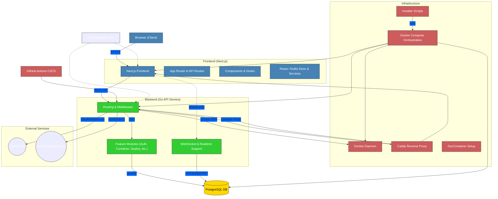

# Architecture

## Overview

This document provides an overview of the architecture for the project, detailing the various components and their interactions.

## API Layer

- **Language**: Go
- **Location**: [api](https://github.com/raghavyuva/nixopus/tree/master/api) directory
- **Description**: The API layer is built using Go, providing backend services. It includes a [Dockerfile](https://github.com/raghavyuva/nixopus/blob/master/api/Dockerfile) for containerization and uses Go modules for dependency management.

## Frontend Layer

- **Framework**: Next.js
- **Location**: [view](https://github.com/raghavyuva/nixopus/tree/master/view) directory
- **Description**: The frontend is built using a JavaScript framework, with configuration files indicating the use of Next.js. It includes a [Dockerfile](https://github.com/raghavyuva/nixopus/blob/master/view/Dockerfile) for containerization and a [package.json](https://github.com/raghavyuva/nixopus/blob/master/view/package.json) for managing dependencies.

## Assets

- **Location**: [assets](https://github.com/raghavyuva/nixopus/tree/master/assets) directory
- **Description**: Contains image files used for branding and UI elements.

## Installation

- **Language**: Python
- **Location**: [installer](https://github.com/raghavyuva/nixopus/tree/master/installer) directory
- **Description**: Python scripts are used for installation and setup, managing the installation process and dependencies.

## Deployment

- **Tools**: Docker, Docker Compose
- **Description**: The project uses Docker for containerization and Docker Compose for orchestrating multi-container applications. Configuration files are provided for both development and staging environments.

## Web Server

- **Tool**: Caddy
- **Location**: [helpers](https://github.com/raghavyuva/nixopus/tree/master/helpers) directory
- **Description**: Caddy is used as a web server, with configuration files provided for setup.

## Documentation

- **Location**: [docs](https://github.com/raghavyuva/nixopus/tree/master/docs) directory
- **Description**: Contains various documentation files and directories, including this architecture overview.

_**Nixopus**_ is an end-to-end platform with a UI built on React.js. The backend is written in Go, which is responsible for managing core functions, including authentication, deployments, and real-time updates via WebSockets.

Data Storage and Management is supported via PostgreSQL database, which the backend accesses for queries and real-time notifications. The entire system operates within Docker containers, coordinated using Docker Compose, with Caddy serving as a reverse proxy to route requests securely.

Nixopus integrates with external services, currently GitHub for login and webhooks, and uses email, Slack, and Discord to send notifications.

Installer scripts are purely used for self-hosting and production deployment purposes only, and development container setups are available to help developers quickly start working on the project. Automated CI/CD pipelines handle testing and deployment, while built-in documentation supports easy maintenance.

This architecture setup allows for a modular and scalable application, leveraging containerization for easy deployment and management.
