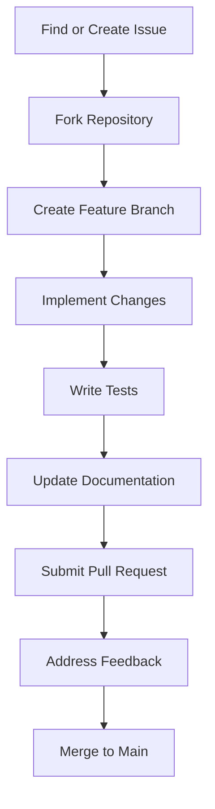

# Nixopus Contribution Guidelines

Welcome to the Nixopus Contribution Guidelines. This page serves as an index to our specialized contribution guides. We value and appreciate all contributions to the project, whether they're bug fixes, feature additions, documentation improvements, or any other enhancements.

## Choose Your Contribution Area

Each specialized guide provides detailed instructions for contributing to specific aspects of Nixopus:

| Contribution Guide | Description | Key Topics |
|-------------------|-------------|------------|
| [General Contributing](index.md) | General contribution workflow | Basic setup, making changes, pull request process |
| [Backend Development](backend.md) | Go backend contributions | API features, database migrations, testing |
| [Frontend Development](frontend.md) | Next.js/React frontend | Component development, Redux integration, UI guidelines |
| [Documentation](documentation.md) | Documentation improvements | Markdown formatting, content guidelines, API docs |
| [Self-Hosting](self-hosting.md) | Installation and self-hosting | Installer improvements, environment support |
| [Docker Builds](docker.md) | Container optimization | Image optimization, security, orchestration |
| [Development Fixtures](fixtures.md) | Development data management | Sample data, testing fixtures, data setup |

## Getting Started

New to contributing? Here's a quick path to making your first contribution:

1. **Choose an area** that interests you from the guides above
2. **Set up your development environment** following the instructions in the relevant guide
3. **Find an issue** to work on - look for issues labeled "good first issue" in our GitHub repository
4. **Implement your changes** following the guide's best practices
5. **Submit a pull request** with your improvements

## Need Help?

If you have questions or need assistance, you can:

- Join our [Discord community](https://discord.gg/skdcq39Wpv)
- Open a discussion on our [GitHub repository](https://github.com/raghavyuva/nixopus/discussions)
- Contact the maintainers directly

## Contribution Process Overview

Here's a high-level overview of our contribution process:

Thank you for contributing to Nixopus! Your efforts help make this project better for everyone.
