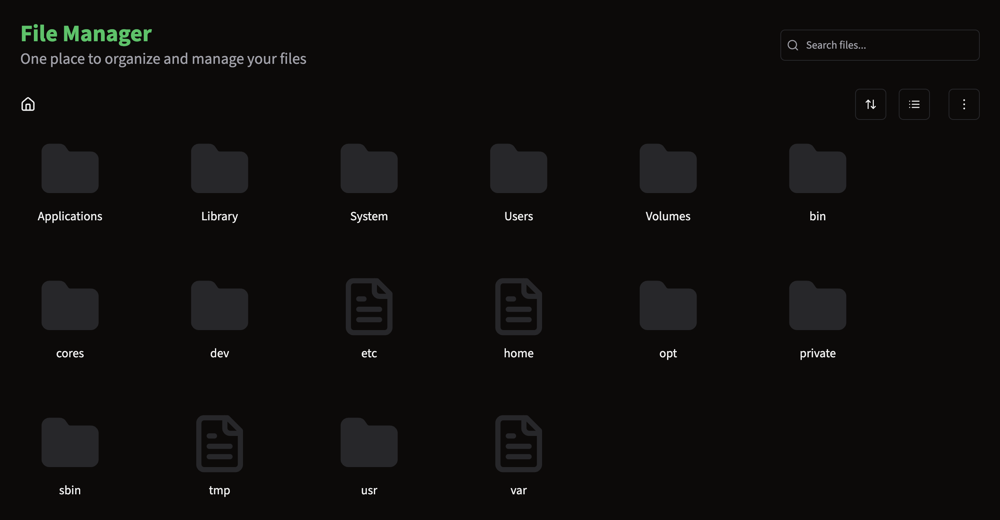

# File Manager

## Introduction
The file manager in Nixopus is unique and is inspired by many file managers on the internet, with added customizability.

## Demo

    <iframe style="position:absolute;top:0;left:0;width:100%;height:100%;" src="https://www.youtube.com/embed/HQZKUge9nw0" title="i created my own protocol for my games..." frameborder="0" allow="accelerometer; autoplay; clipboard-write; encrypted-media; gyroscope; picture-in-picture; web-share" allowfullscreen></iframe>

## Gallery

    

## Key Bindings
The file manager has the following key bindings:

- `CTRL + C` (or `CMD + C` on a Mac): Copy a file.
- `CTRL + X` (or `CMD + X` on a Mac): Cut a file.
- `CTRL + V` (or `CMD + V` on a Mac): Paste a file.

## FAQs

#### How do I change the layout of the file manager?
You can switch between the grid and list view for the file manager by clicking on the layout button on the top right corner of the file manager.

#### How do I sort the files in the file manager?
You can sort the files by clicking on the column header of the criteria you want to sort by. The criteria for sorting are size, name, type, and date.

#### How do I see the file information in the file manager?
You can access the file information by right-clicking on the file and selecting the "Get Info" option from the context menu.

#### Where can I enable the hidden file option in the file manager?
You can enable the hidden file option by clicking on the three dots on the right side of the file manager and selecting "Show Hidden Files" from the dropdown menu.

#### How do I rename a file?
To rename a file, simply double click on the file's name and start typing the new name. Once you've finished, click away from the input field to save the changes.

#### Is there drag and drop support for moving files?
Yes, you can drag a file and drop it into another folder to move the file to that particular folder.

#### How do i open the file in code editor? 
You can open any file or folder from the file manager in the code editor by right clicking on that file and select Open with code editor option from the dropdown menu

#### How do i create a new folder? 
You can create the new folder by clicking on the three dots on the right side of the file manager and selecting "New Folder" from the dropdown menu.

## Upcoming Features :rocket:
* A tree view of the file manager, so you can easily navigate your files
* Improved privacy features for the file manager
* The ability to drag and move files and have them stick to that position persistently, like in the `Mac Finder`
* Customizable icon set to switch between
* `Zip` / `TarBall` extractor or create `zip` / `tarballs`
* File Sync option from local machine 
* File Sync option from multiple servers
* File share and download option
