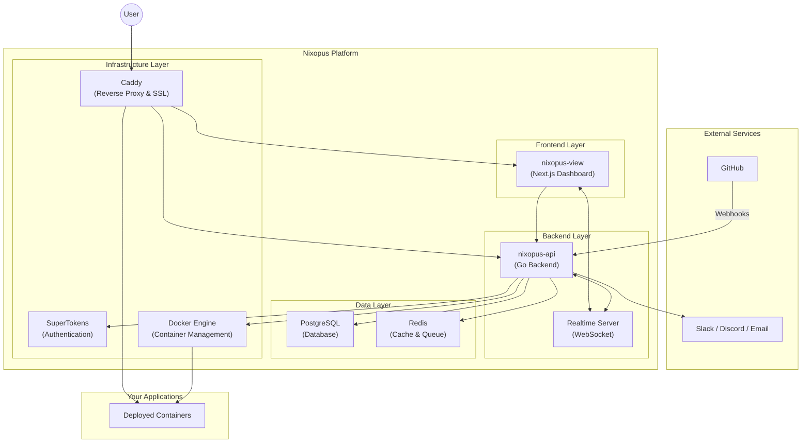

# Introduction

Nixopus is an open-source deployment platform that transforms your VPS into a complete application hosting environment. Deploy applications directly from GitHub, manage server files through a browser-based interface, and execute commands via an integrated terminal. All without leaving the dashboard.

Think of it as a self-hosted alternative to platforms like Vercel, Heroku, or Netlify, but running entirely on your own infrastructure.

## Core Capabilities

| Capability | Description |
|------------|-------------|
| **One-Click Deployments** | Deploy applications from GitHub repositories with automatic builds and zero configuration files |
| **Built-in Terminal** | Execute server commands through a secure, web-based terminal with SSH integration |
| **File Manager** | Browse, edit, upload, and organize files using drag-and-drop operations |
| **Real-time Monitoring** | Track CPU, RAM, and disk usage with live system statistics |
| **Automatic SSL** | Generate and manage HTTPS certificates for your domains automatically |
| **CI/CD Integration** | Trigger deployments automatically when you push code to GitHub |
| **Reverse Proxy** | Route traffic to your applications using the built-in Caddy reverse proxy |
| **Multi-channel Notifications** | Receive deployment alerts via Slack, Discord, or email |

## Why Nixopus?

### Full Infrastructure Control

Unlike managed platforms, Nixopus runs on your own servers. You retain complete control over your infrastructure, data, and costs. No vendor lock-in, no usage-based pricing surprises.

### Developer-First Design

Nixopus prioritizes the tools developers use most. The integrated terminal eliminates context switching between your browser and SSH client. The file manager replaces SFTP clients. GitHub integration removes manual deployment steps.

### Extensible Architecture

Nixopus supports multiple build configurations:

- **Docker Compose**: Deploy multi-container applications
- **Dockerfile**: Build and run containerized applications
- **Static Sites**: Host HTML, CSS, and JavaScript files

Configure environment variables, build commands, and custom domains for each deployment.

## How Nixopus Works

Nixopus runs as a set of containerized services on your VPS:



### Component Overview

| Component | Purpose |
|-----------|---------|
| **nixopus-view** | Next.js web dashboard for managing deployments, files, and terminal sessions |
| **nixopus-api** | Go backend that handles API requests, GitHub webhooks, and orchestrates all operations |
| **PostgreSQL** | Stores application data, user accounts, deployment configurations, and audit logs |
| **Redis** | Manages caching, job queues, and realtime communication channels |
| **Caddy** | Reverse proxy that handles SSL certificates, routes traffic, and load balances requests |
| **SuperTokens** | Manages user authentication, sessions, and access tokens |
| **Docker Engine** | Builds images, runs containers, and manages your deployed applications |

## Quick Start

Install Nixopus on your VPS with a single command:

```bash
curl -sSL https://install.nixopus.com | bash
```

::: tip
See the [Installation Guide](/install/) for detailed options, requirements, and troubleshooting.
:::

## Current Status

::: warning Alpha Release
Nixopus is in active development. The platform is functional for development and testing, but not yet recommended for production workloads. Expect frequent updates and occasional breaking changes.
:::

Report issues and request features on the [GitHub repository](https://github.com/raghavyuva/nixopus/issues).

## Next Steps

- [Installation Guide](/install/) for detailed setup options
- [Hosting Projects](/self-host/) to deploy your first application
- [Terminal](/terminal/) for server command execution
- [File Manager](/file-manager/) to browse and edit files
- [Notifications](/notifications/) to configure alerts

## About the Name

Nixopus combines "octopus" (representing flexibility and multi-tasking) with the Linux penguin mascot (Tux). The name has no connection to NixOS.
